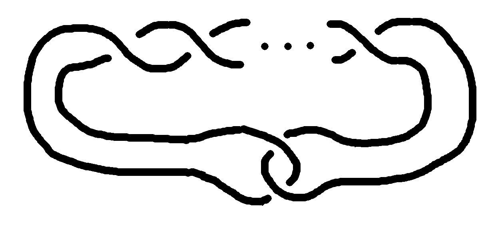

A naive way to define the summation

$$
\sum_{k=a}^b f(k)
$$

is that it is the sum, for all integers $$k$$ such that $$a \leq k \leq b$$, of $$f(k)$$, with the empty sum being 0. Analogously, the product

$$
\prod_{k=a}^b f(k)
$$

would be defined as the product, for all integers $$k$$ such that $$a \leq k \leq b$$, of $$f(k)$$, with the empty product being 1.

While these definitions are obviously correct when $$b \geq a$$ and even when $$b = a - 1$$, I believe they are wrong when $$b < a - 1$$, as they assign the value 0 (resp. 1) to such sums (resp. products) indiscriminately, resulting in them having the wrong number of terms. To see what I mean, note that $$\sum_{k=0}^1 f(k)$$ has 2 terms, $$\sum_{k=0}^0 f(k)$$ has 1 term, and $$\sum_{k=0}^{-1} f(k)$$ has 0 terms. By extrapolation, $$\sum_{k=0}^{-2} f(k)$$ should have -1 terms, but under the naive definition of summation, it only has 0. To correct for this, we define

$$
\sum_{k=0}^{-2} f(k) = -f(-1)
$$

and more generally,

$$
\sum_{k=a}^{b} f(k) = \sum_{b+1}^{a-1} -f(k)
$$

when $$b < a - 1$$. (Although, once we have defined backward summation this way, the equation in fact holds for _all_ $$a$$ and $$b$$.)

This definition results in the nice identities

$$
\sum_{k=a}^b f(k) = \sum_{k=a}^{b-1} f(k) + f(b)
$$

and

$$
\sum_{k=a}^b f(k) + \sum_{k=b+1}^c f(k) = \sum_{k=a}^c f(k)
$$

holding unconditionally.

The equivalent definition for products is

$$
\prod_{k=a}^b f(k) = \prod_{b+1}^{a-1} f(k)^{-1},
$$

which satisfies analogous identities.

Further justification for my definition is found in the following alternative formulation: for integers $$a$$ and $$b$$, let

$$
[a, b] = \begin{cases}1 &\text{if }a \leq b\\ -1&\text{otherwise}\end{cases}.
$$

Then

$$
\sum_{k=a}^b f(k) = \sum_{k\in\mathbb{Z}} \frac{[a, k] + [k, b]}{2} f(k).
$$

The coefficient $$\frac{1}{2}([a, k] + [k, b])$$ is equal to 1 if $$a \leq k$$ and $$k \leq b$$ are both true, 0 if exactly one is true, and -1 if neither are true. From this point of view, the problem with the naive definition is that it does not distinguish the "neither are true" case from the "one is true" case.

### Factorials

One example where my definition is more correct, or at least more insightful, than the naive one is the factorial function, defined as

$$
n! = \prod_{k=1}^n k.
$$

The naive definition incorrectly assigns the value 1 to the factorial of any negative integer. Of course, you can correct for this by explicitly restricting the domain of the factorial to nonnegative integers, but that leaves unexplained the reason for such a restriction. Under my definition, it is clear why negative integers have no factorial: For $$n < 0$$, the product includes the term $$0^{-1}$$, and is therefore undefined (or $$\infty$$ if we allow values in the [extended real numbers](https://en.wikipedia.org/wiki/Projectively_extended_real_line)).

### Triangular numbers

Another example, which goes beyond simply explaining why something is undefined, is given by the triangular numbers. The sequence of triangular numbers $$(T_0, T_1, T_2, T_3, \dots) = (0, 1, 3, 6, \dots)$$ can be extended backwards by noting that $$T_{i-1} = T_i - i$$, and therefore $$T_{-1}$$ should equal $$T_0 - 0 = 0$$, $$T_{-2}$$ should equal $$T_{-1} - (-1) = 1$$, $$T_{-3}$$ should equal $$T_{-2} - (-2) = 3$$, and so on. The definition

$$
T_n = \sum_{k=1}^n k 
$$

automatically includes this backward extension under my definition of summation.

### Jones polynomials

Lastly, an example from more advanced mathematics, and the example that inspired this article, is found in the Jones polynomials of twist knots. (If you don't have any background in knot theory, a _knot_ is an embedding of the circle into 3D space where two embeddings are considered equivalent if you can get from one to the other by moving the circle around without it passing through itself, and there is a thing called the Jones polynomial of a knot.) For $$n \geq 0$$, the twist knot $$T_n$$ looks like

  

where there are $$n$$ crossings on the top, and its Jones polynomial is

$$
{(t^{-3})}^{n\text{ mod }2}\left((-t)^{-n} + (-t)^{-n+1} + (-t)^{-n+2} + \sum_{k=-n+3}^0 2(-t)^k + (-t)^1 + (-t)^2\right).
$$

For $$n \in \{0, 1\}$$, the summation has to be interpreted using my convention. For example, the Jones polynomial of $$T_0$$ (the trivial knot) is

$$
\begin{align*}
& (-t)^0 + (-t)^1 + (-t)^2 + \sum_{k=3}^0 2(-t)^k + (-t)^1 + (-t)^2 \\
=\;& (-t)^0 + (-t)^1 + (-t)^2 - 2(-t)^1 - 2(-t)^2 + (-t)^1 + (-t)^2 \\
=\;& 1. \vphantom{\sum_0^0}
\end{align*}
$$

[Update: After writing this, I realized that that formula for the Jones polynomial of $$T_n$$ can also be written as

$$
{(t^{-3})}^{n\text{ mod }2}\left((-t)^{-n} + (1+t^2)\sum_{k=-n+1}^0 (-t)^k\right),
$$

which never involves any backward summation, but I like this formula somewhat less, the reason being that the first formula separates out all of the powers of $$t$$ (when $$n \geq 2$$), whereas this one does not.]

### Half-inclusive convention

Many properties become nicer when we use the half-inclusive convention in which, when $$a \leq b$$,

$$
\sum_{k=a}^b f(k)
$$

denotes the sum of $$f(k)$$ for all $$k$$ with $$a \leq k < b$$. In this case, the formula for backward sums is simply

$$
\sum_{k=a}^b f(k) = -\sum_{k=b}^a f(k),
$$

and the sum concatenation formula is

$$
\sum_{k=a}^b f(k) + \sum_{k=b}^c f(k) = \sum_{k=a}^c f(k),
$$

analogous to that for integrals.

An alternative (but equivalent) definition is

$$
\sum_{k=a}^b f(k) = \sum_{k\in\mathbb{Z}} \frac{[a, k] - [b, k]}{2} f(k),
$$

with the square bracket being defined as before.

The main problem with the half-inclusive convention is, of course, that it differs from the usual convention. Another problem is that it makes some definitions uglier, such as that of the factorial, which becomes

$$
n! = \prod_{k=1}^{n+1} k.
$$

(Note that the upper bound is now $$n+1$$ rather than $$n$$.) This problem can be resolved by using the _other_ half-inclusive convention, in which case

$$
n! = \prod_{k=0}^n k,
$$

but that disagrees with most existing half-inclusive conventions for ranges of integers, such as Python's `range` function.
