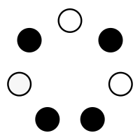
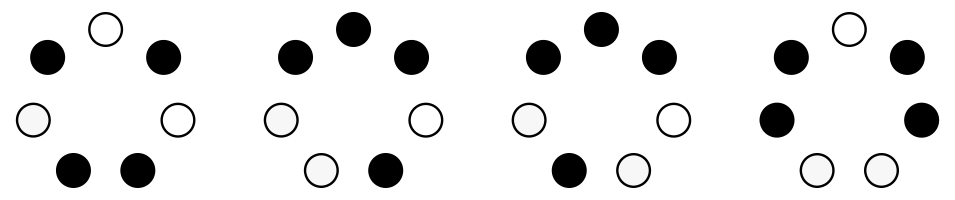
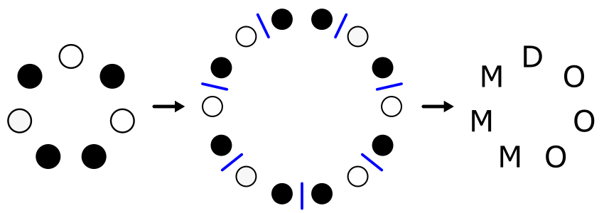
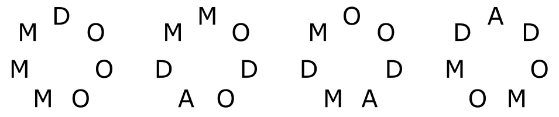
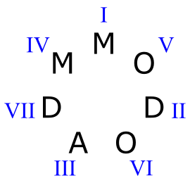
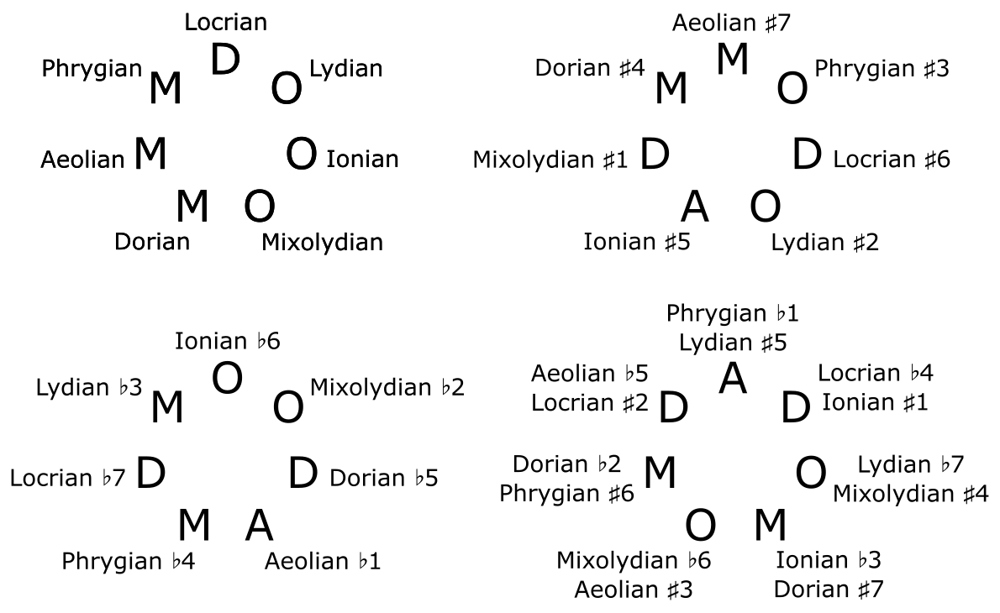
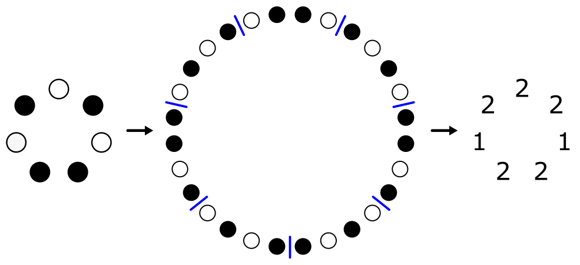
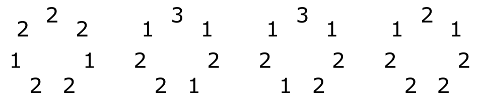

If you play the C major scale, moving up by thirds instead of seconds, you will play the following sequence of notes: C-E-G-B-D-F-A-C. Using ○ to represent major thirds, and ● to represent minor thirds, this corresponds to the following sequence of thirds: ○ ● ○ ● ● ○ ●. Of course, any major scale, regardless of the starting note, contains the same sequence of thirds. So the sequence of thirds is a more invariant object than the sequence of notes.

Using the [lydian scale](https://en.wikipedia.org/wiki/Lydian_mode) instead of the major scale results in this sequence: ○ ● ○ ● ○ ● ●. If you look closely at the two sequences, you will see that they are related to each other by a simple transformation: by moving the last two thirds of the major sequence to the beginning, you get the lydian sequence. That’s because the major scale and the lydian scale are both modes of the diatonic scale. The diatonic scale can be represented by a clockwise _circle_ of thirds, and by “cutting” this circle, you can obtain the _sequence_ of thirds corresponding to any of the seven diatonic modes.

A natural question to ask is _which circles of thirds give rise to valid heptatonic scales?_ Well, any musical scale must span exactly one octave, so the sequence of thirds must span exactly _two_ octaves. If *a* is the number of major thirds and *b* is the number of minor thirds, this fact corresponds to the equation 4*a* + 3*b* = 24. Of course, the total number of thirds in a heptatonic scale is 7, so we can replace *b* with 7 – *a*, and the equation becomes 4*a* + 3(7 – *a*) = 24. Solving this equation is straightforward:

* 4*a* + 21 – 3*a* = 24
* *a* + 21 = 24
* *a* = 3

So the number of major thirds must be 3, and the number of minor thirds must be 4.

Another requirement: musical scales cannot contain the same note twice. So the circle of thirds can’t have 3 major thirds in a row, or 4 minor thirds in a row, as both of these would create an octave.

There are four possible circles that satisfy these requirements, making a total of 28 heptatonic scales.

An important property of a musical scale is which chords one can create with it, and in particular, which _triads_ one can create. There are four possible triads created by stacking two thirds: major, minor, augmented, and diminished; and each note of a scale (at least in the heptatonic scales we are considering) has a triad associated with it&mdash;the triad starting on the given note. Given a circle of seven thirds like the ones above, you can construct a circle of _triads_ by doubling the circle and splitting it into pairs.

(In the image above, "D" stands for "diminished", "M" for "minor", and "O" for "major".) We can do this with each of the four circles to obtain a more detailed picture of the 28 scales:

To understand this image, pick one of the 28 letters; for example, the “M” at the top of the second circle. This corresponds to a scale which starts with a minor triad, then a major triad, then an diminished triad, and so on. Using roman numerals, we can say that this scale has a minor I chord, a major V chord, a diminished II chord, etc. Here are all the possible triads we can make in this scale, along with their numerals:

If we choose a different letter on the same circle as our starting point (i.e. a different mode of the same scale), the possible triads will be the same, but they will have a different relationship to the tonic.

We can label each triad with the name of the scale starting on that triad:

Out of these 28 scales, there are 9 major scales (scales with a major chord as their starting triad), 9 minor scales, 7 diminished scales, and 3 augmented scales. The last two categories are not very practical for writing music, because diminished and augmented triads are dissonant and can’t really play the role of “home chord.”

So far, we have seen circles of thirds and circles of triads, but what about circles of _seconds?_&mdash;that is, what are the steps between consecutive notes in each scale? Recall that the circle of triads was constructed by doubling the circle of thirds and splitting it into pairs. In a similar way, we can construct the circle of seconds by _quadrupling_ the circle of thirds and splitting it into subsequences of length four. The number of major thirds in each subsequence is the size of the corresponding step of the scale.

Here is the circle of seconds for each of the four scale groups:

