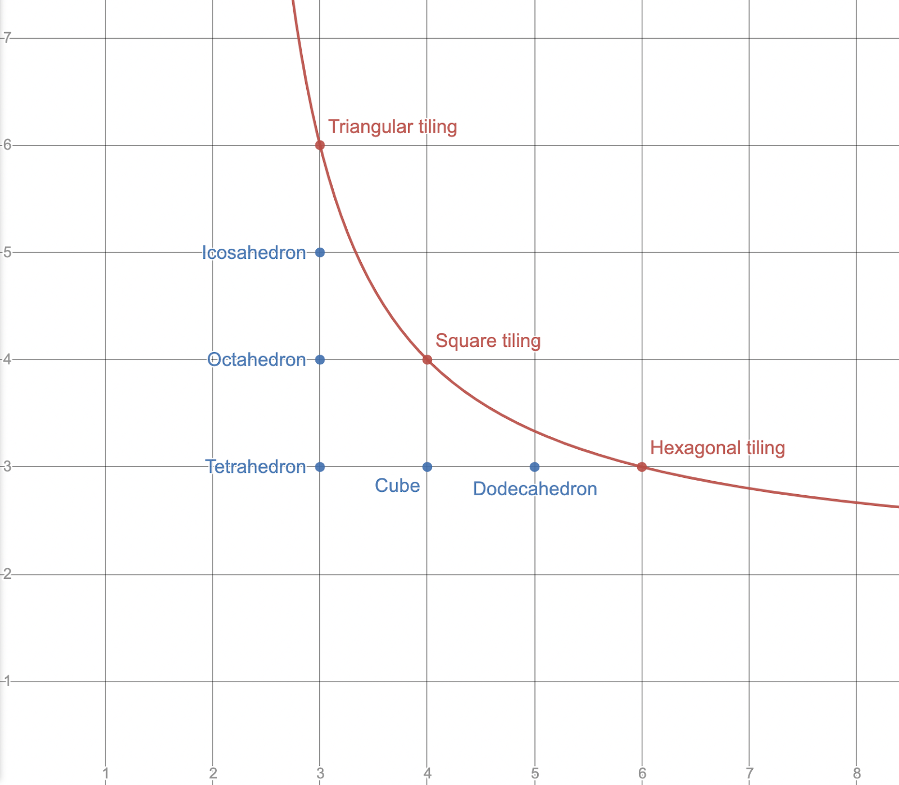
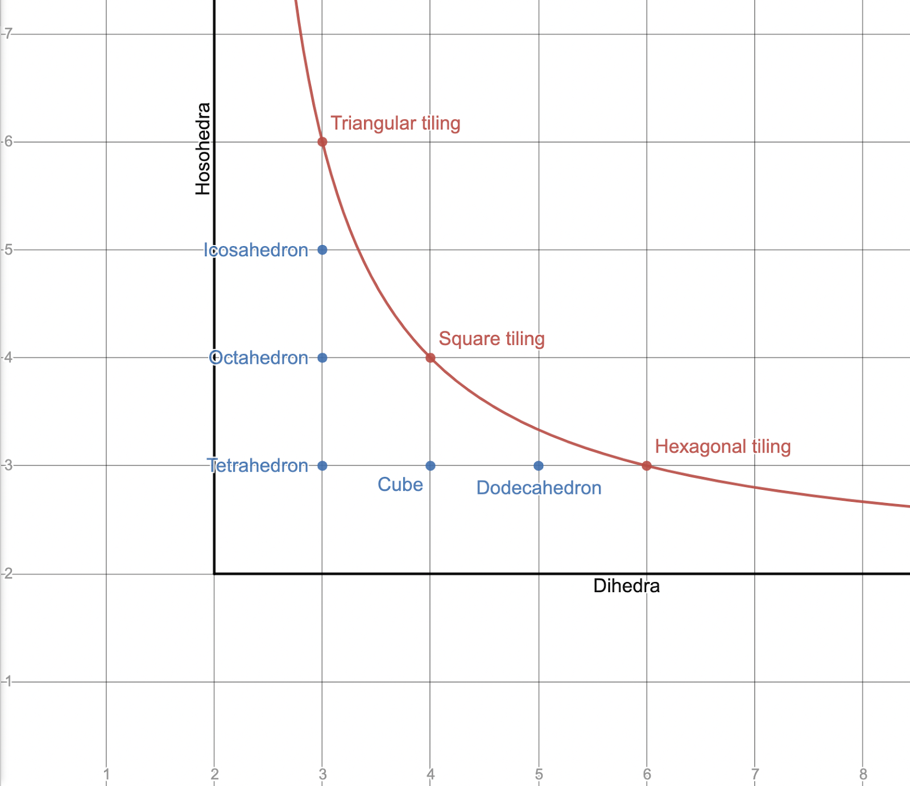

There are five regular convex Euclidean polyhedra. Collectively known as the "Platonic solids," these are:

* the tetrahedron {3, 3}
* the cube {4, 3}
* the octahedron {3, 4}
* the dodecahedron {5, 3}
* the icosahedron {3, 5}

The platonic solids can be identified by their Schläfli symbols, listed above in curly brackets. A Schläfli symbol {a, b} represents the polyhedron formed by attaching b a-gons at each vertex. For example, the dodecahedron is written {5, 3} because each vertex has three pentagons, and the octahedron is written {3, 4} because each vertex has four triangles.

To be a Platonic solid, a polyhedron must be convex. If we remove this requirement, but maintain that the polyhedron cannot intersect itself, we obtain three more polyhedra, each with an infinite number of faces. These are flat rather than convex, and are known as regular apeirohedra or regular tilings.

* the square tiling {4, 4}
* the triangular tiling {3, 6}
* the hexagonal tiling {6, 3}

What is it that makes these polyhedra flat and the Platonic solids convex? And why are there symbols such as {4, 5} that don’t work at all? Precisely, how can one determine from the Schläfli symbol alone whether a polyhedron is 1) flat, 2) convex, or 3) impossible in Euclidean space?

I will define the _feasibility_ of a polyhedron as D{a, b} = 1 - b/2 + b/a, where {a, b} is the Schläfli symbol of the polyhedron. For convex polyhedra, the output of D is positive. (For example, the tetrahedron has a feasibility of 1/2.) For flat polyhedra, the value is 0. For impossible polyhedra such as {6, 4}, it is negative.

It isn’t difficult to show that these statements are true. Consider what happens when we try to fit some number of polygons around a vertex. If there is room left over (i.e. the angles of the polygons add to less than 2π), the resulting polyhedron will be convex. If the angles add to exactly 2π, the polyhedron will be flat. If the angles add to more than 2π, then it is impossible to fit that number of polygons around a single vertex, and the polyhedron cannot exist in Euclidean space. For a regular polygon with a edges, the angles are given by (a - 2) π/a. In a polyhedron {a, b}, there are b faces around each vertex, so the sum of the angles is obtained by multiplying the angle of a single polygon by b: (a - 2) πb/a = πb - 2πb/a. We then divide by 2π to get the total fraction of the circle taken up by the polygons: b/2 - b/a. Finally, we subtract this from 1 to get the fraction _not_ taken up by the polygons, i.e. the fraction of the circle left over after placing b a-gons around a vertex: 1 - b/2 + b/a. This is the feasibility of the polygon. From the derivation of the formula, one can check that if the angle taken up by the polygons is 2π, the end result will be zero, and if the angle is greater than 2π, the result will be negative.

If we plot the equation D{x, y} = 0 on the coordinate plane, the result is a hyperbolic curve. Every lattice point on the curve corresponds to a regular tiling, and every lattice point below the curve (with both coordinates greater than 2) corresponds to one of the five Platonic solids. This is a neat graphical explanation of why there are exactly three regular tilings, and five Platonic solids.

Points of the form (2, n) and (n, 2) are also located below the curve. When considered as solids in Euclidean space, these Schläfli symbols make no sense; it is impossible to have a 2-sided polygon. But if you analyse convex polyhedra as tilings of the sphere, then symbols containing a "2" are perfectly valid; they represent the hosohedra and the dihedra respectively. This interpretation is somewhat cleaner: lattice points on the curve represent tilings of the plane, and lattice points below the curve represent tilings of the sphere.

The concept of "feasibility" can be extended to higher dimensions. For a Schläfli symbol of dimension n, the feasibility is defined as:

$$ D\{a_0, a_1, \ldots a_{n-1}, a_n\} = 1 - a_n \cdot \frac{\theta\{a_0, a_1, \ldots a_{n-1}\}}{2\pi}$$

where θ{a0, a1, ... an-1} represents the dihedral angle of each facet.

The exact formula for θ becomes increasingly complex in higher dimensions:

$$ \begin{align}
  & \theta\{a\} = (a - 2)\frac{\pi}{a} = 2\sin^{-1}\left( \cos\left(\frac{\pi}{a}\right) \right) ^\ast \\
  & \theta\{a, b\} = 2\sin^{-1}\left( \frac{\cos(\frac{\pi}{b})}{\sin(\frac{\pi}{a})} \right) \\
  & \theta\{a, b, c\} = 2\sin^{-1}\left( \cos\left(\frac{\pi}{c}\right) \sin\left(\frac{\pi}{a}\right)
    \sqrt{\frac{1}{\sin(\frac{\pi}{b})^2 - \cos(\frac{\pi}{a})^2}} \right) ^{\ast\ast}
\end{align} $$

\* The equation (a - 2) π/a = 2 sin-1(cos(π/a)) is true for a ≥ 1. This means we can write all three formulas as 2 sin-1(Y), where Y is a function of π/a, π/b, and so on.

** [source for third formula](https://math.stackexchange.com/questions/2748840/dichoral-angle-in-4d-platonic-solid-from-schlafli-symbol/2750226#2750226)

It might be possible to find a general recursive rule for θ using the techniques of linear algebra. This would allow you to calculate the feasibility of any regular polytope in any dimension from the Schläfli symbol alone.

Finally, here is a table of feasibilities for regular polytopes in three, four, and five dimensions:

Schläfli symbol | Name | Feasibility
:-- | :-- | :--
{3, 3} | tetrahedron | 1/2
{4, 3} | cube | 1/4
{3, 4} | octahedron | 1/3
{5, 3} | dodecahedron | 1/10
{3, 5} | icosahedron | 1/6
{3, 6} | triangular tiling | 0
{4, 4} | square tiling | 0
{6, 3} | hexagonal tiling | 0
{3, 3, 3} | 5-cell | 0.41226
{4, 3, 3} | tesseract | 1/4
{3, 3, 4} | 16-cell | 0.21635
{3, 4, 3} | 24-cell | 0.08774
{5, 3, 3} | 120-cell | 0.02862
{3, 3, 5} | 600-cell | 0.02043
{4, 3, 4} | cubic honeycomb | 0
{3, 3, 3, 3} | 5-simplex | 0.37064
{4, 3, 3, 3} | 5-cube | 1/4
{3, 3, 3, 4} | 5-orthoplex | 0.16086
{4, 3, 3, 4} | tesseractic honeycomb | 0
{3, 3, 4, 3} | 16-cell honeycomb | 0
{3, 4, 3, 3} | 24-cell honeycomb | 0
