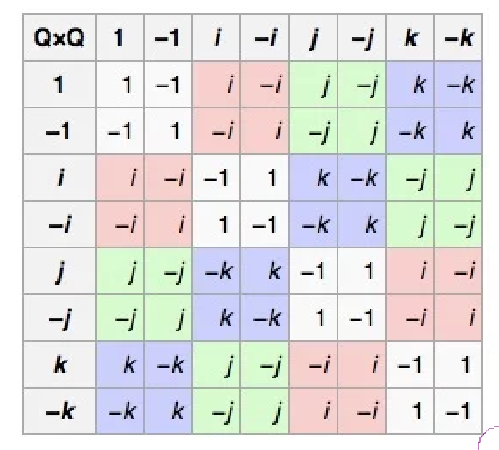

The group algebra of a group $$G$$ over a field $$K$$, denoted $$K[G]$$, is a vector space spanned by basis vectors that correspond to elements of $$G$$. I will write the basis vectors as $$[g]$$ for $$g \in G$$. We can multiply any two vectors in $$K[G]$$ using the bilinear operation generated by $$[g][h] = [gh]$$ for $$g, h \in G$$.

The quaternion 8-group $$Q_8$$ is defined as the set with 8 elements denoted $$\pm 1$$, $$\pm i$$, $$\pm j$$, $$\pm k$$, along with the multiplication operation given in this rather low-resolution image:

We can define the quaternions in terms of the quaternion 8-group by taking the group algebra $$\mathbb{R}[Q_8]$$ and then quotienting by the subspace 

$$ S = \mathrm{span}\{[+1] + [-1], [+i] + [-i], [+j] + [-j], [+k] + [-k]\}. $$

This quotient causes the vector corresponding to $$-i$$ to actually be the negative of the vector corresponding to $$+i$$, and so on. For the quotient to be an algebra, the subspace $$S$$ must be a two-sided ideal; that is, multiplying an element of $$S$$ by any element of $$R[Q_8]$$ (in either order) must always give an element of $$S$$. It is in fact an ideal, the reason being that if you take two elements of $$Q_8$$ which are negatives of each other, and multiply them (on the left or on the right) by the same element of $$Q_8$$, the results are negatives of each other. Or in other words, $$-(xy) = (-x)y = x(-y)$$ for all $$x, y \in Q_8$$, where the negation operation on $$Q_8$$ is the defined in the obvious way.

We can generalize this construction from $$Q_8$$ to any group in which you can "negate" elements. I can think of three equivalent ways to define this concept:

1. A _group with negation_ is a group $$G$$ along with a function $$\nu : G \to G$$ satisfying the identity $$\nu(x)\nu(y) = xy$$.

2. A _group with negation_ is a group $$G$$ along with a chosen element $$\xi$$ such that $$\xi x = x\xi$$ for all $$x \in G$$ (that is, $$\xi$$ is in the center of $$G$$) and $$\xi^2 = 1$$.

3. A _group with negation_ is a group object in the category of $$\mathbb{Z}/2$$-sets (i.e. sets with an action of $$\mathbb{Z}/2$$, or equivalently, sets equipped with an involution), where the tensor product of $$\mathbb{Z}/2$$-sets is the "half-product" defined in [this old article of mine](/blog/tour-of-inv).

To get from definition 1 to definition 2, we take $$\xi = \nu(1)$$. Note that that $$\nu(1)\nu(1) = 1$$ and that, more generally, $$\nu(1)\nu(x) = x$$ for any $$x \in G$$. By multiplying both sides of the latter equation by $$\nu(1)$$ on the left, we obtain $$\nu(x) = \nu(1)x$$ (implying that $$\nu$$ is an bijection, and in fact an involution). By instead taking $$\nu(x)\nu(1) = x$$ and multiplying both sides by $$\nu(1)$$ on the right, we obtain $$\nu(x) = x\nu(1)$$, and hence $$\nu(1)x = x\nu(1)$$. So $$\xi = \nu(1)$$ has the necessary properties.

To get from definition 2 to definition 1, we take $$\nu(x) = \xi x$$. Then 

$$\nu(x)\nu(y) = \xi x \xi y = \xi^2 x y = xy.$$

Of course, if $$\nu(x)$$ is defined as $$\xi x$$, then $$\nu(1) = \xi$$. Similarly, if we start with definition 1 and define $$\xi$$ as $$\nu(1)$$, then $$\xi x = \nu(1) x = \nu(x)$$ for any $$x \in G$$. So our methods of switching between the definitions are inverse to each other. We need to check this because being a "group with negation" is not a property that a group can have, it is an additional structure that is given to a group. A group can admit multiple negation structures; for example, the Klein 4-group admits four, because every element is central and squares to 1.

You may notice that, in any group, we can simply define $$\nu(x) = x$$, or equivalently, $$\xi = 1$$. That is, any group can be made into a rather trivial "group with negation." You could exclude these trivial examples by requiring that $$\xi \neq 1$$, but that would cause groups with negation to no longer be "algebraic structures" in the sense of universal algebra (and would cause definition 3 to no longer hold). Under the current definition, the _category_ of groups with negation (with the morphisms being group homomorphisms that take $$\xi$$ to $$\xi$$) is nicer than it would be under the exclusive definition. I can also think of arguments in favor of the exclusive definition, however. For example, in any nontrivial group with negation, $$\nu$$ has no fixed points (and therefore has $$\lvert G\rvert/2$$ orbits), because if $$\xi x = x$$ for any $$x$$, then $$\xi = 1$$. So there is quite a sharp contrast between trivial and nontrivial examples.

The identity $$\nu(xy) = \nu(x)y = x\nu(y)$$ holds in any group with negation. Indeed, it is obvious if we write it as $$\xi xy = \xi xy = x\xi y$$. So the following construction is valid.

We define the algebra of a group with negation $$(G, \nu)$$ over a field $$K$$ as

$$
K[(G,\nu)] = K[G]/\mathrm{span}\{[x] + [\nu(x)]\}_{x\in G}.
$$

If $$\nu$$ is the identity, the algebra is 0-dimensional, because every basis vector is forced to be its own negative. Otherwise, it is $$\lvert G \rvert /2$$-dimensional. Some examples over the reals:

* The cyclic group $$\{1, a\}$$ with $$\xi = a$$ gives $$\mathbb{R}$$. 
* The cyclic group $$\{1, a, a^2, a^3\}$$ with $$\xi = a^2$$ gives $$\mathbb{C}$$.
* $$Q_8$$ with the natural negation $$\xi = -1$$ gives $$\mathbb{H}$$, the quaternions.

Some additional notes:

* The identity $$\nu(x)^{-1} = \nu(x^{-1})$$ holds in every group with negation.
* We can also define a "monoid with negation"; definitions 1, 2, and 3 are still equivalent if we replace every occurence of "group" with "monoid". One difference between monoids with negation and groups with negation is that the theorem "$$\nu$$ is either the identity or has no fixed points" no longer holds, because, in a monoid, $$\xi x = x$$ for some $$x$$ does not imply $$\xi = 1$$. For example, the integers under multiplication are a monoid with negation, and $$-0 = 0$$.
* Every algebra is a monoid with negation, so there is a forgetful functor from the category of $$K$$-algebras to the category of monoids with negation. I suspect that the left adjoint of this functor (when restricted to groups) is the algebra construction above.
* The concept of a "group with negation" can probably be generalized to that of a "group with $$n$$th roots of unity." These would have $$\xi^n = 1$$ instead of $$\xi^2 = 1$$, and we could construct an algebra over $$\mathbb{C}$$ by taking the quotient of the group algebra by the ideal generated by $$[\xi] - \exp(i\tau/n)[1]$$. Such "groups with $$n$$th roots of unity" could probably be characterized as group objects in the category of $$\mathbb{Z}/n$$-sets, with the tensor product being some generalization of the "half-product."