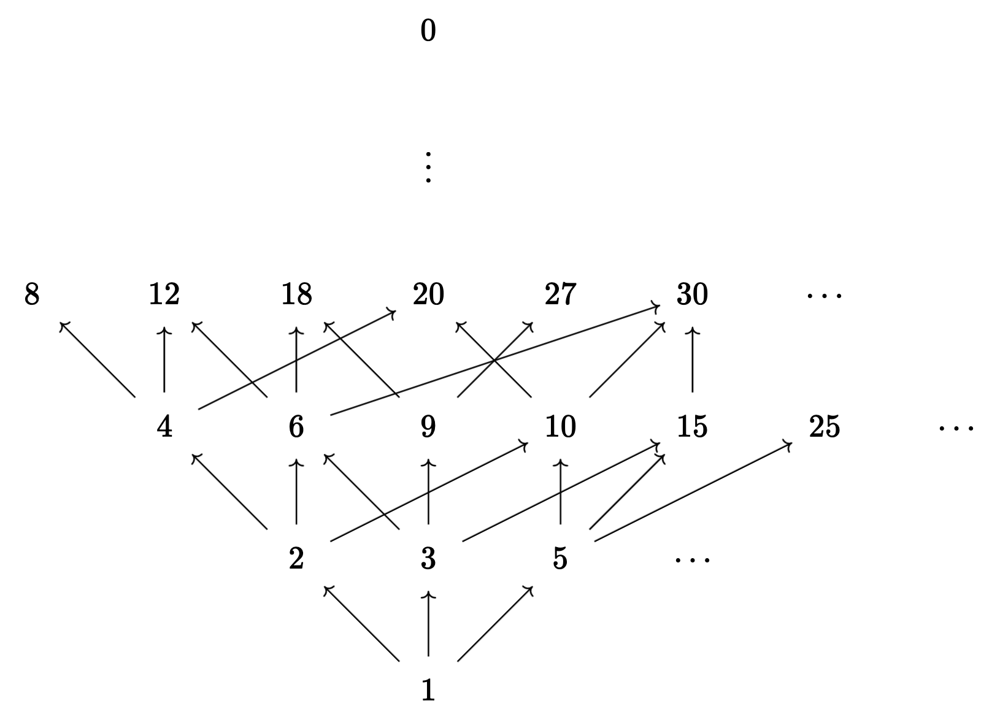

  $$ 
  \newcommand{\N}{\mathbb{N}} 
  \newcommand{\Z}{\mathbb{Z}} 
  \newcommand{\ord}{\mathrm{ord}}
  $$

The set of natural numbers $$\N = \{0,1,2,\dots\}$$ is one of the most well-studied objects in mathematics. As you know, there are two elementary binary operations defined on the natural numbers: addition and multiplication. Each of these operations gives rise to an ordering of the naturals.

The first ordering&mdash;the additive one&mdash;is the usual ordering that we are all familiar with. The reason I call this "additive" is that the relation $$\leq$$ can be defined in terms of addition: for $$a, b \in \N$$, $$a \leq b$$ if and only if there is some $$x \in \N$$ such that $$a + x = b$$.

The second ordering is analagous, but is defined using multiplication instead of addition. We say that $$a$$ "divides" $$b$$ if there is some $$x \in \N$$ such that $$ax = b$$. This is often denoted $$a \mid b$$.

The "divides" relation is not always thought of as an ordering, but it shares many properties with the usual ordering $$\leq$$:

1. Both relations are reflexive: $$a \leq a$$ and $$a \mid a$$ for all $$a \in \N$$.
2. Both relations are [transitive](https://en.wikipedia.org/wiki/Transitive_relation).
3. Both relations are [antisymmetric](https://en.wikipedia.org/wiki/Antisymmetric_relation).
4. Any two naturals $$a$$ and $$b$$ have a unique [supremum](https://en.wikipedia.org/wiki/Infimum_and_supremum) (least upper bound) with respect to both relations: the supremum with respect to $$\leq$$ is the maximum of $$a$$ and $$b$$, and the supremum with respect to $$\mid$$ is the least common multiple of $$a$$ and $$b$$.
5. Any two naturals have a unique infimum (greatest lower bound) with respect to both relations: the infimum with respect to $$\leq$$ is the minimum, and the infimum with respect to $$\mid$$ is the greatest common divisor.
6. Both relations have a "minimal" element: $$0 \leq a$$ for all $$a \in \N$$, and $$1 \mid a$$ for all $$a \in \N$$.

(A relation satisfying properties 1&ndash;3 is called a [partial order](https://en.wikipedia.org/wiki/Partially_ordered_set), and a relation satisfying 1&ndash;5 is called a [lattice](https://en.wikipedia.org/wiki/Lattice_(order)).)

However, there is one important property that $$\leq$$ has, but that $$\mid$$ does not: for any two naturals $$a$$ and $$b$$, it is always the case that either $$a \leq b$$ or $$b \leq a$$. But this is not true if $$\leq$$ is replaced by $$\mid$$; for example, $$2\not\mid 3$$ and $$3\not\mid 2$$. A mathematician would say that $$\leq$$ is a _total_ (or linear) order, but $$\mid$$ is only a _partial_ order.

Because of this, the structure of the $$\mid$$ relation is significantly more complex than that of $$\leq$$.

In the diagram above, there is an arrow from $$n$$ to $$np$$ for each positive integer $$n$$ and each prime number $$p$$. The bottom row contains only the number 1, which has zero prime factors ([1 is the empty product](https://en.wikipedia.org/wiki/Empty_product)), the next row up contains the numbers with one prime factor (the primes), the next row contains the numbers with two prime factors, and so on. There is a path from $$a$$ to $$b$$ if and only if $$a \mid b$$, and 0 is placed at the top to signify that every number divides 0.

Although the diagram may look may look complicated (the arrows don't seem to follow any spatial pattern), that's only because I've projected what is essentially an infinite-dimensional diagram down to two dimensions. The infinite-dimensional version of the diagram is much simpler. Specifically, positive integers correspond to infinite-dimensional vectors where all of the coordinates are natural numbers and only finitely many coordinates are positive. Each dimension corresponds to a prime. For example, the vector corresponding to 84 is (2, 1, 0, 1, 0, 0, ...), because $$84 = 2^2 3^1 5^0 7^1 11^0 13^0 \cdots$$. Then to construct the diagram above in this infinite-dimensional space, all you need to do is connect each point to its neighboring points, forming a lattice.

Multiplication of positive integers corresponds to addition of vectors in this infinite-dimensional space. The greatest common divisor of two positive integers corresponds to the componentwise minimum of their vectors, and the least common multiple corresponds to the componentwise maximum. This correspondence can be extended to all natural numbers by assigning to 0 the "vector" $$(\infty, \infty, \dots)$$. This works because $$p^n$$ divides 0 for all primes $$p$$ and for arbitrarily large $$n$$, so there is a sense in which 0 contains infinitely many copies of every possible prime factor.

The relations $$\mid$$ and $$\leq$$ are logically related in the following way: _if $$b$$ is positive_, then $$a \mid b$$ implies $$a \leq b$$. This can lead to some confusion, which was my motivation for writing this article. I believe there are many cases where people use $$\leq$$ in definitions when they really should use $$\mid$$. I illustrate my point with two examples:

### What is gcd(0, 0)?

The greatest common divisor of $$a$$ and $$b$$ is typically defined as "the greatest number $$x$$ such that $$x\mid a$$ and $$x\mid b$$." This definition works fine when both inputs are positive. It also works when one of the inputs is zero: if $$a = 0$$ and $$b > 0$$, then _everything_ divides $$a$$, so the common divisors of $$a$$ and $$b$$ are just the divisors of $$b$$, the largest of which is $$b$$ itself, so $$\gcd(0, b) = b$$.

However, if $$a = b = 0$$, this definition goes wrong. Every natural number is a common divisor of 0 and 0, so $$\gcd(0,0)$$ is the greatest natural number, which doesn't exist. (Infinity is a number, but it isn't a _natural_ number.) You'd expect $$\gcd(0,0)$$ to be 0, since $$\gcd(0,b) = b$$ for all positive $$b$$, but instead it's undefined. 

We can fix this problem by understanding the "greatest" in "greatest common divisor" to mean not "maximal with respect to $$\leq$$," but rather "maximal with respect to $$\mid$$." Since 0 is the greatest natural number in the latter sense, we find that $$\gcd(0,0) = 0$$.

This definition of greatest common divisor is also simpler in the sense that it involves only the $$\mid$$ relation rather than a combination of the $$\mid$$ and $$\leq$$ relations. 

### It's order 0, not order $$\infty$$!

Another example is the notion of the order of an element in group theory. Typically, $$\ord(x)$$ is defined as the least positive integer $$n$$ such that $$x^n = 1$$, or $$\infty$$ if there is no such $$n$$. 

I propose an alternative definition: $$\ord(x)$$ is the least (with respect to $$\mid$$) natural number such that $$x^n = 1$$. That is, replace $$\leq$$ with $$\mid$$ and "positive integer" with "natural number," and remove the second clause.

This new definition of order produces the same results as the original one, but with $$\infty$$ replaced by 0. Importantly, it removes the special handling of "infinite-order elements." Whenever a function is defined by cases, any proof of a proposition involving that function will need to use case analysis. So definitions that don't include multiple cases are almost always better than ones that do.

Some other nice properties of the new definition:
* $$\ord(x)$$ is the generator of the subgroup of integers $$n$$ such that $$x^n = 1$$. In other words, an integer $$n$$ satisfies $$x^n = 1$$ if and only if $$n$$ is a multiple of $$\ord(x)$$.
* $$\langle x \rangle \subseteq G$$ is isomorphic to $$\Z / \langle \ord(x) \rangle$$.

The new definition of order also matches the notion of the characteristic of a field. Specifically, the characteristic of a field $$K$$ is the additive order of the element $$1 \in K$$. (Fields that contain the rational numbers are usually said to have characteristic 0, not $$\infty$$.)