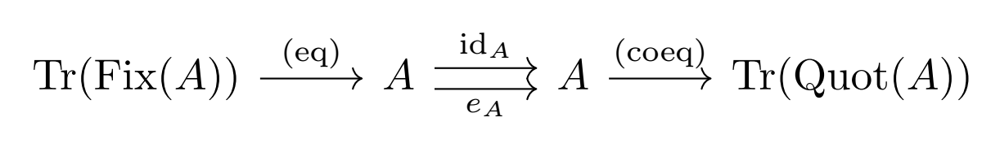
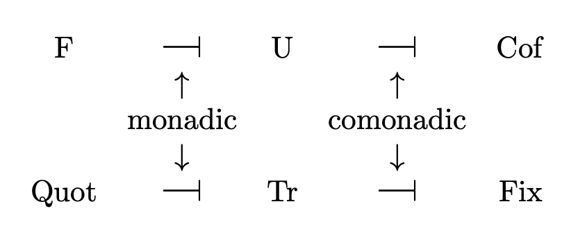
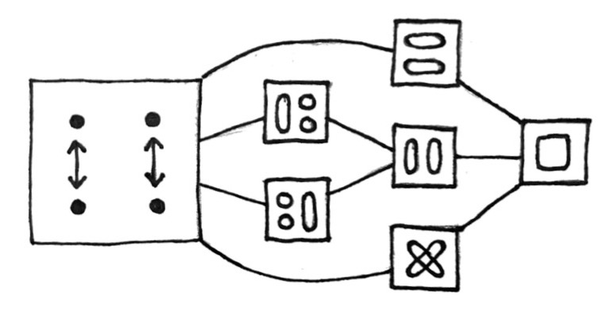

Here are some facts about **Inv** that I failed to mention in the [previous article](../tour-of-inv):

* There is a nontrivial natural isomorphism e&nbsp;:&nbsp;IdInv&nbsp;→&nbsp;IdInv, whose component at each object A is the defining involution of A. Since each component of e is an involution, e is itself an involution in the functor category End(**Inv**). The naturality condition for e states that for all morphisms f, f&nbsp;∘&nbsp;eA&nbsp;=&nbsp;eB&nbsp;∘&nbsp;f, which is true by definition.

* The monomorphisms of **Inv** are the injective morphisms, and the epimorphisms of **Inv** are the surjective morphisms.

* The composite functors Tr ∘ Fix and Tr&nbsp;∘&nbsp;Quot are dual to each other in the following sense: For all objects A, Tr(Fix(A)) is the equalizer of eA and idA, and Tr(Quot(A)) is the _coequalizer_ of eA and idA.

  

### Relationship between Inv and Set

The functor Tr : **Set** → **Inv** is fully faithful, and has both a left and a right adjoint. This makes **Set** a [bireflective subcategory](https://ncatlab.org/nlab/show/bireflective+subcategory) of **Inv**. In a way, objects of **Inv** are a generalization of sets: they are sets in which some of the points have been "expanded" into "double points." Then a set is just a trivial object of **Inv**, i.e. one with no double points.

Quot ⊣ Tr is a [monadic adjunction](https://ncatlab.org/nlab/show/monadic+adjunction); algebras over the monad Tr&nbsp;∘&nbsp;Quot are equivalent to sets. To see this, note that an algebra over Tr&nbsp;∘&nbsp;Quot is an object A along with a retraction of the natural morphism f&nbsp;:&nbsp;A&nbsp;→&nbsp;Tr(Quot(A)). If A is trivial, then f is the identity, so f has exactly one retraction (namely, the identity). If A is non-trivial, then f is not injective, and therefore has no retractions.

Dually, Tr ⊣ Fix is a _comonadic adjunction_; coalgebras over the comonad Tr&nbsp;∘&nbsp;Fix are equivalent to sets. To see this, note that a coalgebra over Tr&nbsp;∘&nbsp;Fix is an object A along with a section of the natural morphism f&nbsp;:&nbsp;Tr(Fix(A))&nbsp;→&nbsp;A. Such a section can only exist if every point of A is a fixed point, in which case A is trivial, f is the identity, and so f has exactly one section.

F ⊣ U is a monadic adjunction, since **Inv** is an algebraic category.

Dually, U ⊣ Cof is a comonadic adjunction; the category of coalgebras over U&nbsp;∘&nbsp;Cof is equivalent to **Inv**. If you unravel the definition, you will see that a coalgebra over U&nbsp;∘&nbsp;Cof is simply a set X along with a function f&nbsp;:&nbsp;X&nbsp;→&nbsp;X&nbsp;×&nbsp;X whose first component is the identity and whose second component is an involution, and that the only requirement on coalgebra morphisms is that they must preserve the involutions.

Another (less precise) way of stating the points above is that **Inv** is "both algebraic and coalgebraic over **Set**," and **Set** is "both algebraic and coalgebraic over **Inv**." 
  

### Topos structure

**Inv** is a topos; the trivial object with two elements serves as a subobject classifier, and the power object of an object A is Tr(P(Quot(A))).

The subobject poset of an object A is simply the poset of subsets of Quot(A). (Because every subobject of A is uniquely determined by which orbits it contains.)

However, the quotient object posets cannot be reduced in such a way. For example, the free four-element object F(2) has seven quotient objects (corresponding to seven congruences, depicted below), but there is no set with seven quotient sets.

**Inv** is not well-pointed; the terminal object 1 is not a [separator](https://ncatlab.org/nlab/show/separator). However, the free object with two elements (which I denoted 2 in the last article) _is_ a separator. Intuitively, maps out of 1 cannot reach all the elements of an object; they can reach the fixed points, but not the double points. To reach the double points, you need to use 2 instead. In fact, maps from 2 to A correspond exactly to elements of A.

### N-ary half products

In the last article, I defined an operation called the "half-product," which is both commutative and associative. I described only binary half-products, but not n-ary half-products for higher n. It turns out that the n-ary half-product A1&nbsp;∧&nbsp;...&nbsp;∧&nbsp;An is the quotient of the set U(A1)&nbsp;×&nbsp;...&nbsp;×&nbsp;U(An) by the relation identifying (a1,&nbsp;...,&nbsp;an) with (f1(a1),&nbsp;...,&nbsp;fn(an)), where an even number of the fi are equal to eAi, and the rest are the identity. The involution on A1&nbsp;∧&nbsp;...&nbsp;∧&nbsp;An acts in the obvious way: by inverting an odd number of components. 
  
For example, in the ternary half-product A&nbsp;∧&nbsp;B&nbsp;∧&nbsp;C, the triples (a,&nbsp;b,&nbsp;c), (a,&nbsp;b\*,&nbsp;c\*), (a\*,&nbsp;b,&nbsp;c\*), and (a\*,&nbsp;b\*,&nbsp;c) are all identified, and (a,&nbsp;b,&nbsp;c)\*&nbsp;= (a\*,&nbsp;b,&nbsp;c)&nbsp;= (a,&nbsp;b\*,&nbsp;c)&nbsp;= (a,&nbsp;b,&nbsp;c\*)&nbsp;= (a\*,&nbsp;b\*,&nbsp;c\*). Here I am using (&mdash;)\* to denote the involutions.

An equivalent description of n-ary half-products is as follows: For objects A1,&nbsp;...,&nbsp;An in **Inv**, there is a natural action of (ℤ/2ℤ)n on the set U(A1)&nbsp;×&nbsp;...&nbsp;×&nbsp;U(An). Let E be the subgroup of (ℤ/2ℤ)n consisting of elements with an even number of 1s. Then A1&nbsp;∧&nbsp;...&nbsp;∧&nbsp;An is the quotient of U(A1)&nbsp;×&nbsp;...&nbsp;×&nbsp;U(An) by the inherited action of E, and ℤ/2ℤ acts on A1&nbsp;∧&nbsp;...&nbsp;∧&nbsp;An by acting on any of the components&mdash;it doesn't matter which component you choose.

Surprisingly, neither of the characterizations above works in the nullary case. The empty half-product is 2, but 2 is not a quotient of the empty product!

Here's a characterization that _does_ work in the nullary case: For objects A1,&nbsp;...,&nbsp;An in **Inv**, let X be the n-ary product of their underlying sets. For 1&nbsp;≤&nbsp;i&nbsp;≤&nbsp;n, define ki&nbsp;:&nbsp;X&nbsp;→&nbsp;X to be the function that applies eAi to the i-th coordinate. Then A1&nbsp;∧&nbsp;...&nbsp;∧&nbsp;An is the coequalizer in **Inv** of the n&nbsp;+&nbsp;1 parallel morphisms F(k1),&nbsp;...,&nbsp;F(kn),&nbsp;eF(X)&nbsp;: F(X)&nbsp;→&nbsp;F(X).

