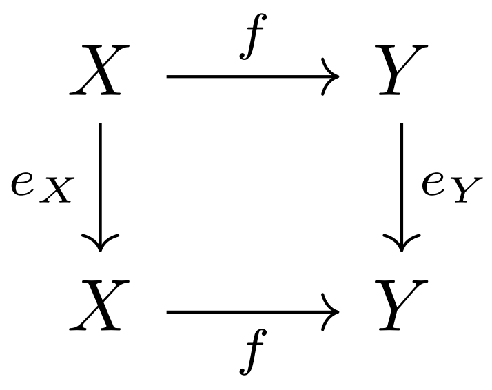
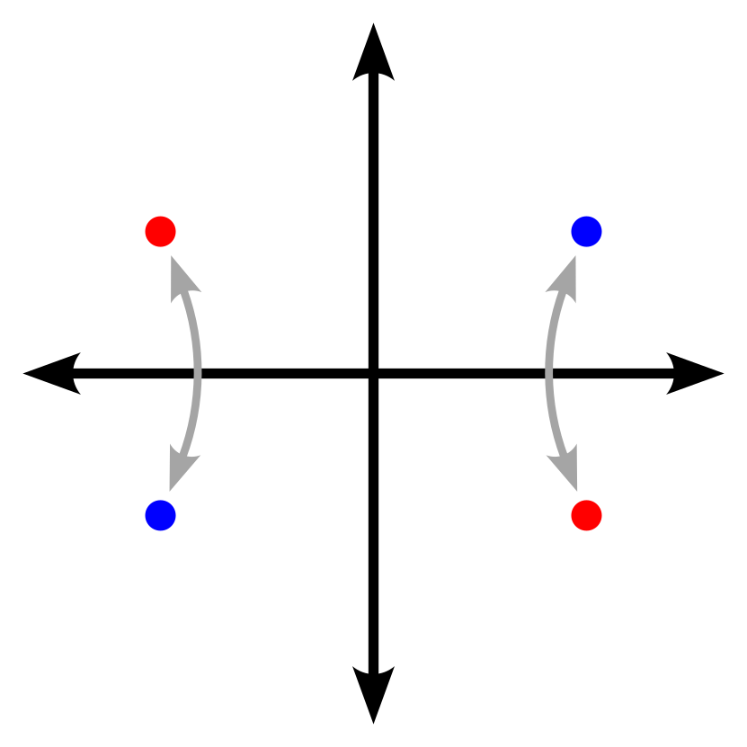

One my favorite mathematical exercises is coming up with a category, and finding out as many basic facts about it as I can. For example: what are its products and coproducts? what sorts of functors can be defined on it? is it a closed monoidal category?  and so on. This article is an introduction to the category of involutions, which I will call **Inv**.

All of the facts in this article were discovered and proved by myself. I have decided to omit most of the proofs, however, because I feel that including them would be tedious and unenlightening.

### Definition

An object of **Inv** is a set X along with an involution eX on X, i.e. a function eX&nbsp;:&nbsp;X&nbsp;→&nbsp;X such that eX&nbsp;∘&nbsp;eX&nbsp;=&nbsp;idX. A morphism from (X,&nbsp;eX) to (Y,&nbsp;eY) is a function f&nbsp;:&nbsp;X&nbsp;→&nbsp;Y such that f&nbsp;∘&nbsp;eX&nbsp;=&nbsp;eY&nbsp;∘&nbsp;f, or equivalently, eY&nbsp;∘&nbsp;f&nbsp;∘&nbsp;eX&nbsp;=&nbsp;f.

**Inv** can also be defined as the category of functors from D to **Set**, where D is the one-element category corresponding to the group ℤ/2ℤ. Then the morphisms of **Inv** are just natural transformations.

### Functors

There is a forgetful functor U taking an object of **Inv** to its underlying set. U has a left adjoint F, as well as a right adjoint Cof. For any set X, F(X) is the object whose underlying set is X&nbsp;⊔&nbsp;X and whose involution swaps the two copies of X. Dually, Cof(X) is the object whose underlying set is X&nbsp;×&nbsp;X, and whose involution swaps the two coordinates in each pair.

There are three other functors worth mentioning:
* Tr : **Set** → **Inv** takes a set X to the pair (X,&nbsp;idX): the trivial involution on X.
* Fix : **Inv** → **Set** takes an involution to its set of fixed points. (This functor is well-defined because morphisms in **Inv** always map fixed points to fixed points.)
* Quot : **Inv** → **Set** takes an involution to its set of orbits. (This is well-defined because morphisms in **Inv** map inverses to inverses.)

Suppose A ∈ **Inv** and X ∈ **Set**. Morphisms from A to Tr(X) correspond to functions from Quot(A) to X, because each orbit in A must map to exactly one point of Tr(X). Also, morphisms from Tr(X) to A correspond to functions from X to Fix(A), since every point of Tr(X) is a fixed point, and must therefore map to a fixed point in A. So there is a double adjunction Quot&nbsp;⊣&nbsp;Tr&nbsp;⊣&nbsp;Fix.

The functors defined so far satisfy the following identities:

* Fix ∘ Tr = Id
* Quot ∘ Tr = Id
* Fix ∘ Cof = Id
* Quot ∘ F = Id
* Fix ∘ F = Δ0

where "=" means "naturally isomorphic" and Δ0 is the constant functor sending everything to the empty set. Also, for any set X, Quot(Cof(X)) is the set of unordered pairs with elements in X.

Note that the defining involution of any object in **Inv** is itself a morphism in **Inv**. I will hereafter denote the defining involution of an object A as eA.

### Monoidal structure

For any two objects A and B in **Inv**, their coproduct A&nbsp;⊔&nbsp;B has U(A)&nbsp;⊔&nbsp;U(B) as its underlying set, and eA&nbsp;⊔&nbsp;eB as its involution. Likewise, their product A&nbsp;×&nbsp;B has U(A)&nbsp;×&nbsp;U(B) as its underlying set, and eA&nbsp;×&nbsp;eB as its involution. The initial and terminal objects of **Inv** are simply those of **Set** equipped with the identity.

For objects A B ∈ **Inv**, there is a natural involution on Hom(A,&nbsp;B), defined by e[A&nbsp;→&nbsp;B](f)&nbsp;=&nbsp;f&nbsp;∘&nbsp;eA&nbsp;=&nbsp;eB&nbsp;∘&nbsp;f. This makes Hom(A,&nbsp;B) into an object of **Inv**; I will denote this "internal hom object" as [A&nbsp;→&nbsp;B].

For objects A B ∈ **Inv**, one can form their "half-product", denoted A&nbsp;∧&nbsp;B. The underlying set of A&nbsp;∧&nbsp;B is the quotient of U(A)&nbsp;×&nbsp;U(B) by the relation (a,&nbsp;b)&nbsp;~&nbsp;(eAa,&nbsp;eBb) for all a&nbsp;∈&nbsp;A and b&nbsp;∈&nbsp;B. The involution on A&nbsp;∧&nbsp;B is given by (a,&nbsp;b)&nbsp;↦&nbsp;(eAa,&nbsp;b)&nbsp;=&nbsp;(a,&nbsp;eBb). A basic example of the half-product is given by the following. Let A&nbsp;=&nbsp;(ℝ,&nbsp;-); the set of real numbers along with negation. Then A&nbsp;∧&nbsp;A is the set of pairs of opposite points in ℝ2, with involution given by reflection across the x-axis, or equivalently, reflection across the y-axis.

The half-product is commutative, associative, and unital, with the non-trivial two-element object 2 acting as an identity. In other words, (**Inv**,&nbsp;∧,&nbsp;2) is a symmetric monoidal category. Moreover, there is a natural bijection between Hom(A&nbsp;∧&nbsp;B,&nbsp;C) and Hom(A,&nbsp;[B&nbsp;→&nbsp;C]), for any choice of A, B, and C, so **Inv** is in fact a monoidal closed category with ∧ as its tensor product.

**Inv** can also be made into a _cartesian_ closed category. In this case, the internal-hom is not [A&nbsp;→&nbsp;B], but a different object which I will denote Func(A,&nbsp;B). The underlying set of Func(A,&nbsp;B) is the set of all functions from U(A) to U(B), and the involution on Func(A,&nbsp;B) is given by f&nbsp;↦&nbsp;eB&nbsp;∘&nbsp;f&nbsp;∘&nbsp;eA. Note that the fixed points of this involution are precisely the morphisms in **Inv**; in other words, Fix(Func(A,&nbsp;B)) = Hom(A,&nbsp;B).

The following identities hold for all objects A&nbsp;∈&nbsp;**Inv**:

* F(X) ∧ A = Tr(X) × A
* [F(X) → A] = Func(Tr(X), A)
* Tr(X) ∧ A = Tr(X × Quot(A))
* [Tr(X) → A] = Tr(Hom(X, Fix(A)))

### Monoids

There are two obvious ways to define monoids in **Inv**: using ∧, or using ×. In both cases, the resulting monoids are just monoids in **Set** along with an involution that interacts with the monoid structure in a particular way.

A monoid in (**Inv**, ∧, 2) consists of:
* A monoid (M, ·, 1) in **Set**.
* A function - : M → M, satisfying the following properties:
  * -(-a) = a
  * (-x) · y = x · (-y) = -(x · y)

A monoid in (**Inv**, ×, 1) consists of:
* A monoid (M, ·, 1) in **Set**.
* A function (&mdash;)\* : M → M, satisfying the following properties:
  * (a\*)\* = a
  * 1\* = 1
  * (a · b)\* = a\* · b\*

For any objects A B ∈ Inv, [A → B] is a monoid of the first kind, with morphism composition as its binary operation. Similarly, Func(A,&nbsp;B) is a monoid of the second kind. Also note that any ring is a monoid of the first kind; this is why I chose to denote the involution with "-".
