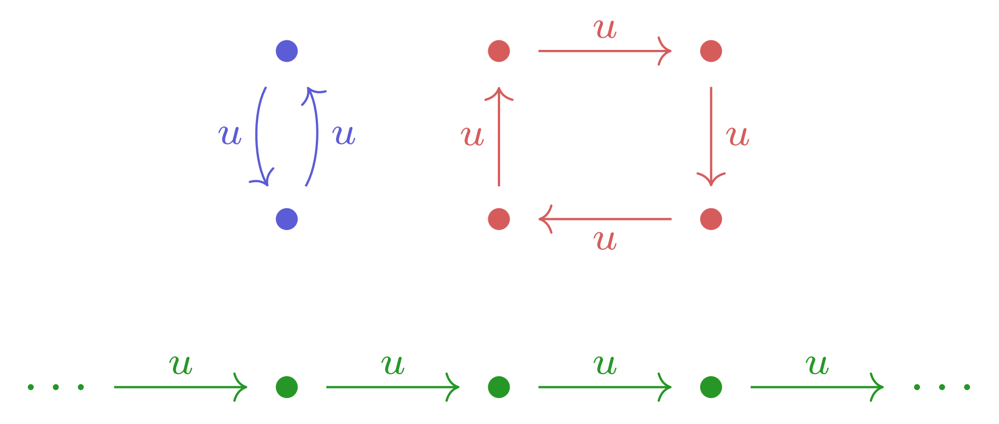

$$ 
\newcommand{\Z}{\mathbb{Z}} 
\newcommand{\Orb}{\mathrm{Orb}}
\newcommand{\ord}{\mathrm{ord}}
\newcommand{\Fix}{\mathrm{Fix}}
$$
I came up with the following lemma while working on my upcoming article about Ternary Gate Automata. 

The problem is: Suppose $$X$$ and $$Y$$ are sets, and $$u : X \to X$$ and $$v : Y \to Y$$ are bijections (invertible functions). How many functions $$f : X \to Y$$ are there such that $$f \circ u = v \circ f$$, i.e. $$f(u(x)) = v(f(x))$$ for all $$x \in X$$? (For the sake of this article, I will refer to such functions as _homomorphisms_.)

I'll start by defining some useful notation.

1. Since $$u$$ is a bijection, one can raise it to any integer power by composing itself or its inverse the given number of times. For example, $$u^2(x) = u(u(x))$$ and $$u^{-3}(x) = u^{-1}(u^{-1}(u^{-1}(x)))$$. $$u^0(x)$$ is just $$x$$. 

2. For any $$a \in X$$, one can form the subset $$\Orb_u(a) \subseteq X$$ consisting of elements that are reachable from $$a$$ by repeated application of $$u$$ or its inverse. Explicitly, $$\Orb_u(a) = \{ u^n(a) : n \in \Z \}$$. $$\Orb$$ is short for "orbit," and $$\Orb_u(a)$$ is called the orbit of $$a$$.

    For all elements $$a, b \in X$$, the sets $$\Orb_u(a)$$ and $$\Orb_u(b)$$ are either equal or disjoint. (This is easy to prove.) In other words, $$X$$ is a disjoint union of orbits, like in the image below: 
    
    

3. I will define the "order" of an element $$a \in X$$, denoted $$\ord_u(a)$$, to be the size of $$\Orb_u(a)$$ if $$\Orb_u(a)$$ is finite, or 0 if $$\Orb_u(a)$$ is infinite. For example, in the image above, the blue points have order 2, the red points have order 4, and the green points have order 0. One nice property of this definiton is that for any integer $$n$$, $$u^n(a) = a$$ if and only if $$n$$ is a multiple of $$\ord_u(a)$$. 

4. I will write $$X/u$$ for the set of orbits in $$X$$, $$X_n$$ for the subset of $$X$$ consisting of elements of order $$n$$, and $$X_n/u$$ for the set of order-$$n$$ orbits in $$X$$. I will write $$\Fix(u^n)$$ for the set of fixed points of $$u^n$$, i.e. the set of elements $$x \in X$$ such that $$u^n(x) = x$$.

5. Lastly, I will define a "representative subset" of $$X$$ to be a subset with exactly one element from each orbit. (Or equivalently, a [section](https://en.wikipedia.org/wiki/Section_(category_theory)) of the function $$\Orb_u : X \to X/u$$.)

All of these notions can be defined for $$Y$$ and $$v$$ as well.

Recall that we're trying to count the number of homomorphisms from $$X$$ to $$Y$$. The first step toward answering this question is to note that every homomorphism $$f : X \to Y$$ satisfies the property

$$
f \circ u^n = v^n \circ f \text{ for all } n \in \Z.
$$

The case where $$n = 1$$ is the definition of a homomorphism. The case where $$n = -1$$ can be proven as follows: Compose $$v^{-1}$$ on the left and $$u^{-1}$$ on the right on both sides of the defining equation of a homomorphism to get $$v^{-1} \circ f \circ u \circ u^{-1} = v^{-1} \circ v \circ f \circ u^{-1}$$. After cancellation, this becomes $$v^{-1} \circ f = f \circ u^{-1}$$; QED. All the other cases can be proven by repeatedly appling the $$n = 1$$ and $$n = -1$$ cases.

This property implies that, once we know the value $$f(x)$$ for a single element $$x \in X$$, the values of $$f$$ on the entire orbit of $$x$$ are determined: $$f(u^n(x)) = v^n(f(x))$$. This gives an upper bound on the number of homomorphisms: If we fix some representative subset $$A \subseteq X$$, then any homomorphism is determined by its values on $$A$$, so there is at most one homomorphism for each function from $$A$$ to $$Y$$, of which there are 

$$
|Y|^{|A|} = |Y|^{|X/u|}.
$$

This is an upper bound rather than an exact solution because some functions from $$A$$ to $$Y$$ might not correspond to homomorphisms; it might not be possible to map any element of $$A$$ to any element of $$Y$$. For example, if $$x \in A$$ has order 4, then it is not possible to map $$x$$ to an element of $$Y$$ of order 3 and still get a homomorphism. This is because $$u^4(x) = x$$, so $$f(u^4(x)) = v^4(f(x))$$ _should_ equal $$f(x)$$, which is not the case if $$f(x)$$ has order $$3$$. 

In general, a homomorphism can only map an element of order $$n$$ to an element $$y \in Y$$ such that $$v^n(y) = y$$. In other words, elements of $$X_n$$ must map to elements of $$\Fix(v^n)$$. (And in particular, an element of order 0 can map to any element of $$Y$$, since $$\Fix(v^0) = Y$$.)

So the exact number of homomorphisms is

$$
\prod_{n \geq 0} |\Fix(v^n)|^{|X_n/u|}.
$$

The property of orders I noted earlier&thinsp;&mdash;&thinsp;namely, $$v^n(y) = y$$ if and only $$n$$ is a multiple of $$\ord_v(y)$$&thinsp;&mdash;&thinsp;allows one to rewrite the above as

$$
\prod_{n \geq 0} \left(\sum_{d \mid n} |Y_d| \right)^{|X_n/u|},
$$

where the sum is taken over all divisors $$d$$ of $$n$$.

These expressions are still valid even if the sizes of the sets involved are infinite. In that case, the sums, products, and exponents are done in the [infinite cardinals](https://en.wikipedia.org/wiki/Cardinal_number) rather than the natural numbers. (Also, $$0^0 = 1$$.)

### Connection to group theory and special cases

The question addressed in this article can also be defined in terms of group actions on sets. In particular, an action of the group of integers $$\Z$$ on a set $$X$$ is the same as a bijection from $$X$$ to itself. Given an action $$+ : (\Z, X) \to X$$, the corresponding bijection is $$x \mapsto 1 + x$$, and given a bijection $$f : X \to X$$, the corresponding action is $$(n, x) \mapsto f^n(x)$$. 

Under this identification, the question answered in this article becomes: given two sets $$X$$ and $$Y$$, both acted on by the group $$\Z$$, how many functions $$f : X \to Y$$ are there which preserve the group action, in the sense that $$f(n + x) = n + f(x)$$ for all $$n \in \Z$$ and $$x \in X$$?

Answering this question also answers the corresponding question for any finite cyclic group $$\Z_n$$, since actions of $$\Z_n$$ on a set $$X$$ are a special case of actions of $$\Z$$ on $$X$$&thinsp;&mdash;&thinsp;they are the actions in which the order of all elements of $$X$$ divides $$n$$. 

A particularly simple case occurs when the cyclic group under consideration is a prime-order group $$\Z_p$$. In that case, the order of every element of $$X$$ must be either 1 or $$p$$, so $$X_n$$ is empty for all $$n \not\in \{1,p\}$$. The forumla given at the end of the preceding section then becomes the finite product

$$
|Y_1|^{|X_1/\Z_p|} (|Y_1 + Y_p|)^{|X_p|/\Z_p} = |Y_1|^{|X_1|} |Y|^{|X_p|/p}.
$$

An even simpler case occurs when the cyclic group in question is the trivial group $$\Z_1$$, or equivalently, the order of every element of $$X$$ and $$Y$$ is 1. In this case, the formula becomes

$$
|Y_1|^{|X_1/\Z_1|} = |Y|^|X|,
$$

reproducing the formula for the total number of functions from $$X$$ to $$Y$$.