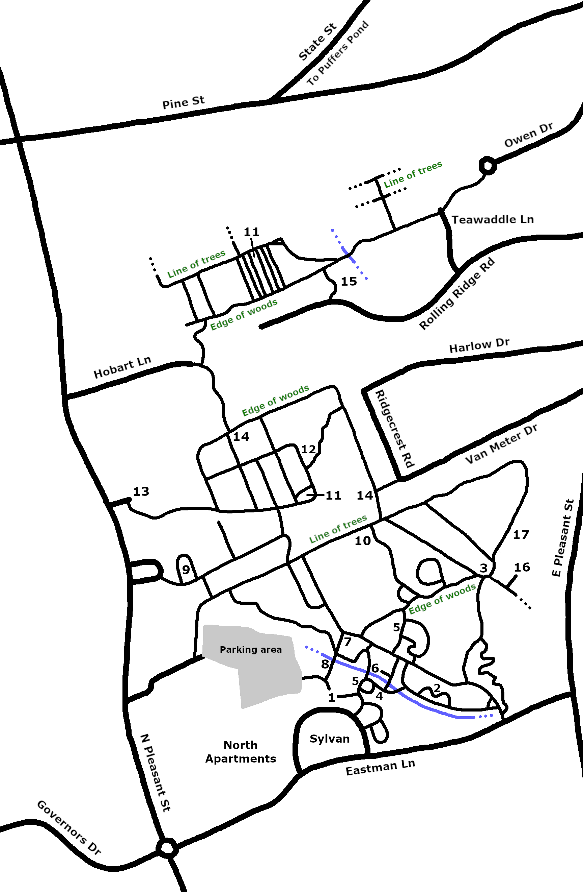

In the summer of 2024, I spent a large part of a day mapping the trails north of UMass. I didn't use any compass or GPS, so my original map was rather inaccurate in terms of directions and distances. To make a more accurate map, I used satellite images as well as Apple maps (which includes a few of the trails in the woods), tracing over those trails that were visible and then adding in the remaining trails. There are also trails in other parts of campus, in particular to the west and south of this map, and I might map out those in the fall.

1. Basketball court
2. Pit
3. Swing
4. "The spot"
5. Branch hut (2)
6. Long bridge
7. Trailer and fence
8. Big log
9. Pollinator garden and blueberries
10. Orchard
11. Greenhouse (2)*
12. Mermaid statue
13. Massachusetts Farm Bureau Federation hall
14. Agricultural Learning Center sign (2)
15. Rolling Ridge Conservation Area
16. "Labyrinth"
17. Brick house

*You can go inside the northern one, but the southern one is locked.